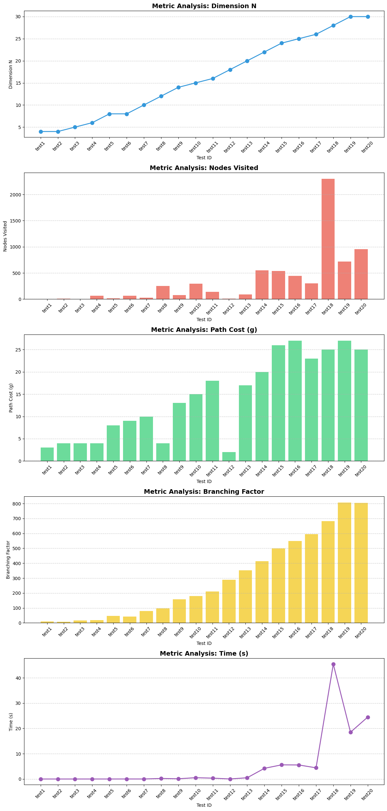

# N-Queens Problem: A* Search vs. Constraint Satisfaction Problem (CSP)

This project explores two different Artificial Intelligence approaches to solve the classic **N-Queens Puzzle**. The objective is to place $N$ chess queens on an $N \times N$ chessboard so that no two queens threaten each other (no two queens share the same row, column, or diagonal).

## 🧩 Problem Description
The N-Queens problem is a well-known combinatorial challenge used to test search algorithms and optimization solvers. In this project, we represent the board as an array of $N$ integers, where the index represents the column and the value represents the row of the queen in that column.

We compare two paradigms:
1. **State-Space Search (A-star)**: Fixing queens in columns and moving them across rows to minimize conflicts using a heuristic function.
2. **Constraint Satisfaction Problem (CSP)**: Modeling the board as a set of variables and constraints, solved using the Google OR-Tools CP-SAT solver.

## 🚀 Project Features
- **A-star Algorithm Implementation**: Uses a custom heuristic (number of attacking pairs) and optimal search strategies (duplicate elimination).
- **CSP Modeling**: Implements global constraints (`AllDifferent`) for rows and diagonals.
- **Performance Analysis**: A comprehensive test suite comparing execution time, nodes expanded (A*), and internal solver metrics like branches and conflicts (CSP).
- **Visualization**: Graphical representation of the board in the console and data analysis visualization using Matplotlib and Pandas.

## 🛠 Requirements
To run the Jupyter Notebook or Python scripts, you need the following dependencies:

- **Python 3.7+**
- **OR-Tools**: Google's specialized solver for CP problems.
- **Pandas**: For data manipulation and summary tables.
- **Matplotlib**: For generating performance charts.

You can install the required libraries using pip:
```bash
pip install ortools pandas matplotlib
```
The solver is integrated in the Python library `OR-Tools`, so there is no need to install anything else to execute. Just run the jupyter Notebook and in some minutes will be automatically executed.

## 📊 Results and Discussion

### Performance Comparison
Experimental data shows a massive performance gap as the problem scales.

| Metric | A* Search ($N=30$) | CSP Solver ($N=30$) | CSP Solver ($N=300$) |
| :--- | :--- | :--- | :--- |
| **Execution Time** | ~18.2s - 24.4s | **~0.025s** | ~98.7s |
| **Search Effort** | 720 - 955 Nodes | 434 - 776 Branches | 634,689 Branches |
| **Internal Conflicts** | N/A | **0** | 5,923 |

## 📈 Performance Visualizations

### A* Search Performance


### CSP Solver Performance


### Key Findings
- **The A-star Bottleneck**: For $N > 20$, the branching factor (exceeding 800 at $N=30$) and the cost of heuristic evaluation in Python lead to a "complexity wall." Execution time becomes highly sensitive to the initial configuration.
- **The CSP Efficiency**: The CP-SAT solver remains nearly instantaneous for $N=30$. In most cases, **Internal Conflicts remain at 0**, proving that *Constraint Propagation* prunes the search space perfectly without the need for backtracking.
- **Stress Testing**: While A* is unfeasible for large boards, the CSP paradigm successfully solves $N=300$ in approximately 98 seconds, demonstrating industrial-grade scalability.

## 💻 Execution Guide
1. **Load the Notebook**: Open `N_Queens_Project.ipynb` in Jupyter or Google Colab.
2. **Run A-star Tests**: Execute the first block to see A* metrics for $N \in [4, 30]$.
3. **Run CSP Solver**: Execute the second block to solve dimensions up to $N=300$.
4. **View Analytics**: The final cells will generate summary tables and bar charts comparing Time, Conflicts, and Branches.

## 🏆 Final Conclusion
Constraint Satisfaction is significantly more efficient than traditional State-Space Search for the N-Queens problem. By utilizing logical inference and global constraints, the CSP approach bypasses the exponential explosion of states that weaken the A* algorithm.